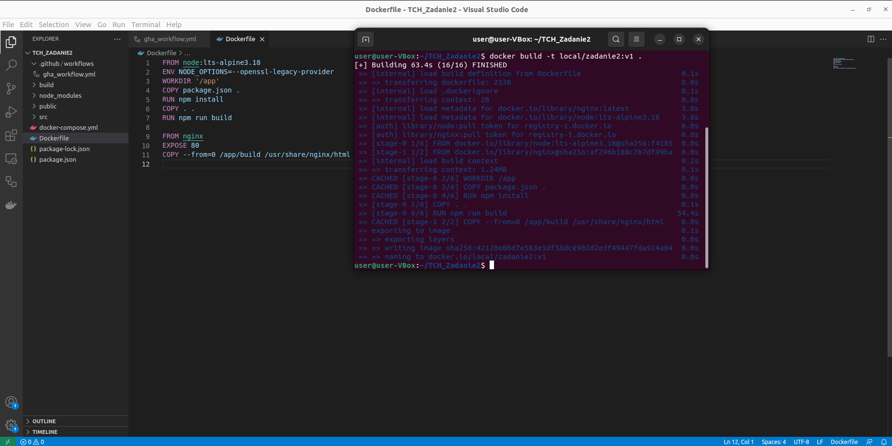
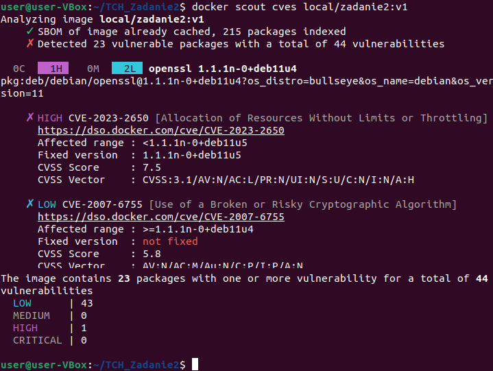

# TCH_Zadanie2

# Przebieg zadania - część podstawowa:
 1. Modyfikacja kodu źródłowego (wyświetlenie imienia i nazwiska)
    * zbudowanie [screen](screens/TCH2_3.png):
        ```
        docker compose up -d --build
        ```
    * efekt:
        

 2. Zbudowanie obrazu i przetestowanie pod kątem CVE:
    * polecenia:
        ```
        docker build -t local/zadanie2:v1 .
        ```
        ```
        docker scout cves local/zadanie2:v1
        ```

    * efekt:
        
        

 3. Opracowanie łańcucha działań w ramach Github Actions:
    [gha_workflow.yml](.github/workflows/gha_workflow.yml)

 4. przesłanie obrazu na repo ghcr:
    [LINK](https://github.com/users/krystiancz21/packages/container/package/tchzadanie2)


# Przebieg zadania - część dodatkowa:
 1. Opracowanie nowego gha_workflow w którym zostało dodane wersjonowanie:
    [gha_workflow_v2.yml](.github/workflows/gha_workflow_v2.yml)

 2. Po kolejnym uruchomieniu GitHub Action zmienia się wersja - inkrementowana jest wartość "path"
    Natomiast dokonanie drobnej zmiany w kodzie powoduje zwiększenie wartości "minor".
    Efekty widać po wejściu w poniższy link:
    [LINK](https://github.com/users/krystiancz21/packages/container/package/tchzadanie2img)


# Źródła:

Wykorzystane źródła do opracowania rozwiązania:

1. [logwanie i przesłanie obrazu do ghcr](https://docs.docker.com/build/ci/github-actions/push-multi-registries/)

2. [cache inline](https://docs.docker.com/build/ci/github-actions/cache/#inline-cache)

3. Do wykoania części dodatkowej wspomogłem się poniższym rozwiązaniem: [semver](https://github.com/RollerKnobster/SS-Actions-Auto-Version/blob/main/.github/workflows/CI.yml) [i tym :)](https://github.com/PaulHatch/semantic-version)
