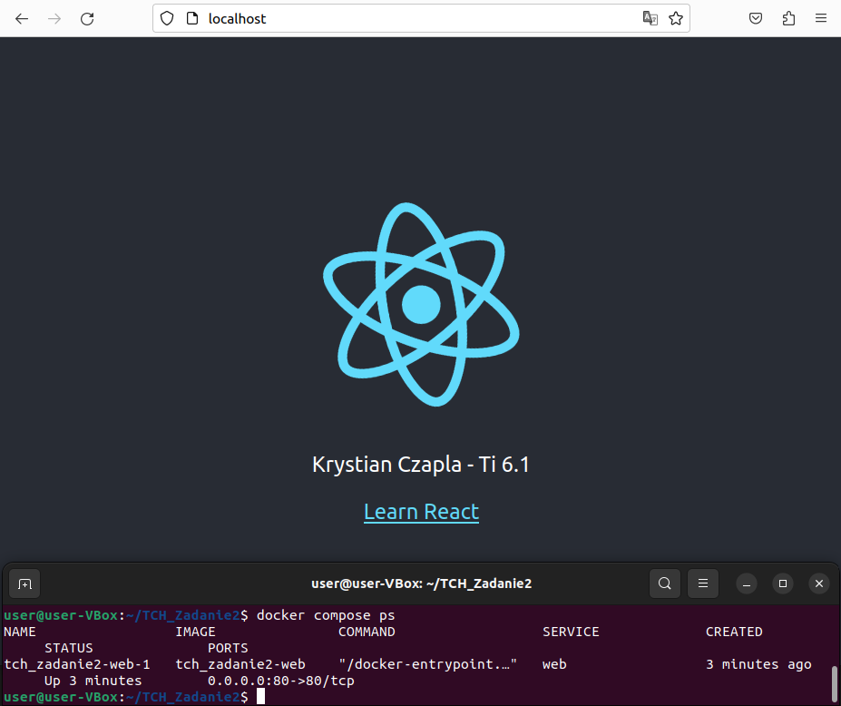
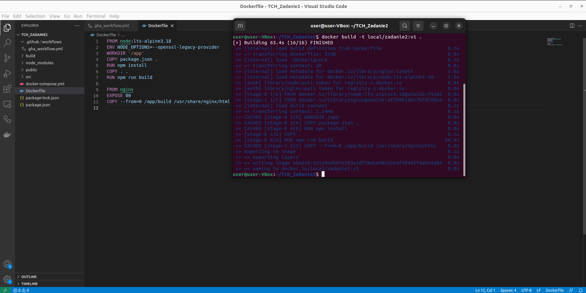
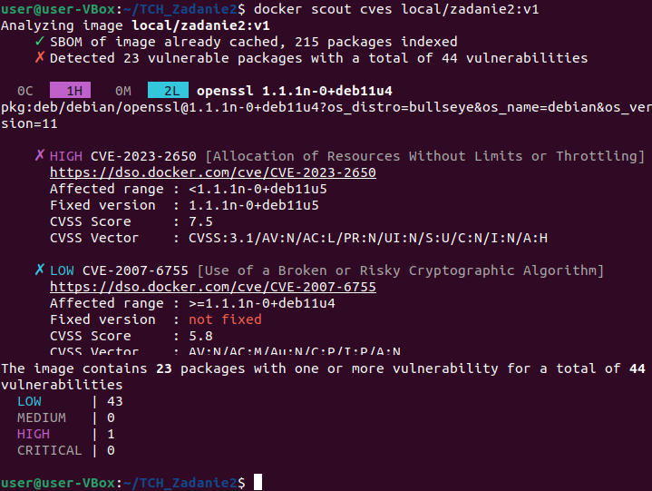

# TCH_Zadanie2

Przebieg zadania - część podstawowa:
 1. Modyfikacja kodu źródłowego (wyświetlenie imienia i nazwiska)
    * zbudowanie [screen](screens/TCH2_3.png):
        ```
        docker compose up -d --build
        ```
    * efekt:
        

 2. Zbudowanie obrazu i przetestowanie pod kątem CVE:
    * polecenia:
        ```
        docker build -t local/zadanie2:v1 .
        ```
        ```
        docker scout cves local/zadanie2:v1
        ```

    * efekt:
        
        

 3. Opracowanie łańcucha działań w ramach Github Actions:
    [gha_workflow.yml](.github/workflows/gha_workflow.yml)

 4. przesłanie obrazu na repo ghcr:
    [LINK](https://github.com/users/krystiancz21/packages/container/package/tchzadanie2)